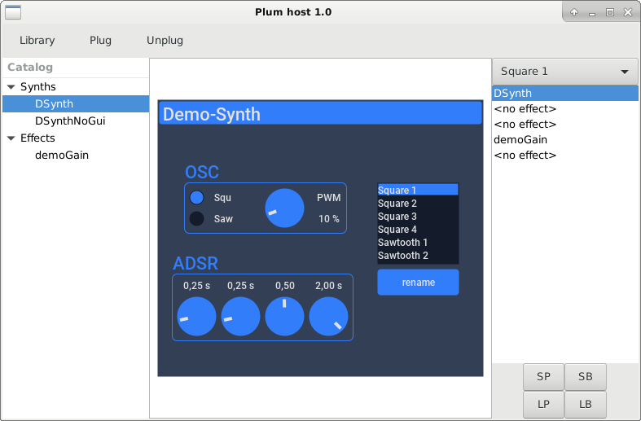

PLUM DEMO PROJECT
-----------------

This project builds a plum demo host and a plum demo plugin for Linux.
The plugin contains a synth and an effect.

The host has already the current folder in the shared library path.

The demo host has: 

- A toolbar with three buttons: Library, Plug, Unplug.
- A catalog (left side) that shows the library content.
- A list of plugins (track, right side). There are slots for one synth and up to four effects.
- A view that shows the gui of the selected plugin or a controller if the plugin is headless.

Pressing "Library" lets you choose the library. Only one library at a time can be loaded.
Once a library is loaded, the catalog is filled. 

Select a plugin in the catalog, select a slot on the right list (track) and press "Plug"
and the plugin will be created. 

Select a plugin on the track, press "Unplug" and the plugin will be destroyed.

A combo box lets you choose the presets.

The buttons LP, SP, LB, SB, let you load and save banks and presets.

BUILDING
--------

Download **plumsdk**, **abcdgui**, **DyLib**.
Download and build **TonicLib**.

Create the file **libs.txt** with the following four lines:

    set(plum_path "<path to plumsdk>")
    set(dylib_path "<path to DyLib>")
    set(abcd_path "<path to abcdgui>")
    set(tonic_path "<path to TonicLib>")

    cd build
    cmake .. -Dexternal_libs="<path to libs.txt>" -DCMAKE_INSTALL_PREFIX=.. 

    make && make install

Host and plugin will be created in the bin folder.

DEPENDENCIES:
-------------

- Jack Audio Connection Kit 2

- GTKMM 3

- plumsdk (BSL-1.0 License)

[https://github.com/beatwise/plumsdk](https://github.com/beatwise/plumsdk)

Compiled as part of the demo.

- abcdgui (MIT License)

[https://github.com/beatwise/abcdgui](https://github.com/beatwise/abcdgui)

Compiled as part of the demo.

- DyLib (MIT License)

[https://github.com/tocola/DyLib](https://github.com/tocola/DyLib)

Compiled as part of the demo.

Only DyLib.hpp is required.

- TonicLib (The Unlicense)

[https://github.com/TonicAudio/Tonic](https://github.com/TonicAudio/Tonic)

Compile it with	-fPIC

Install it like:

	installation-folder/
		include/
			Tonic/*.h
			Tonic.h
		lib/
			libTonicLib.a

